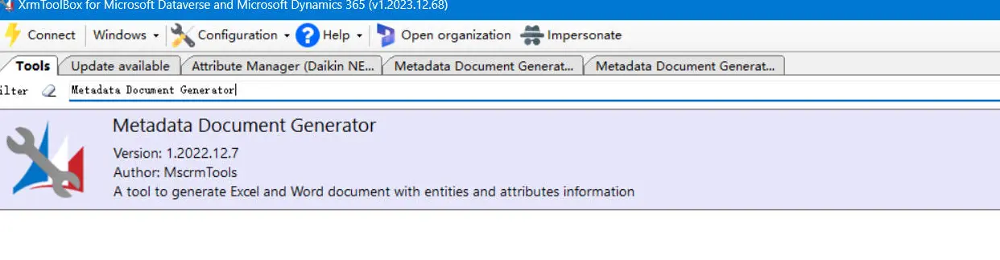
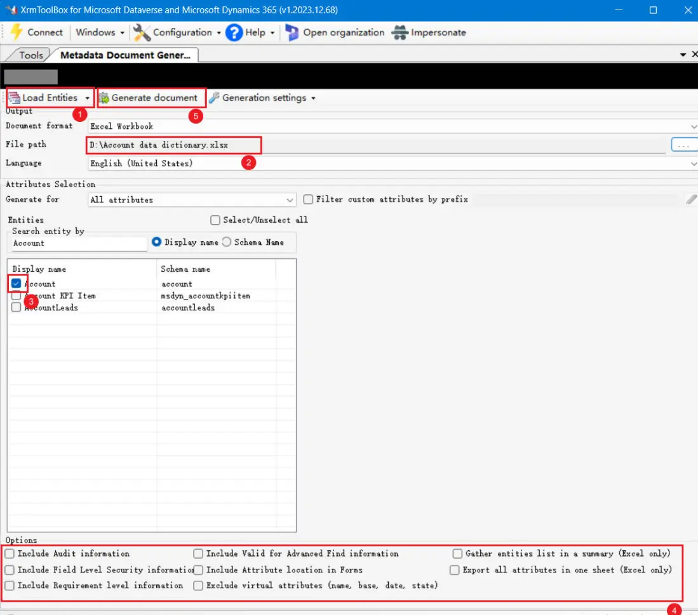
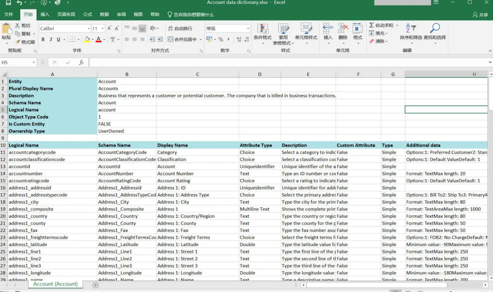
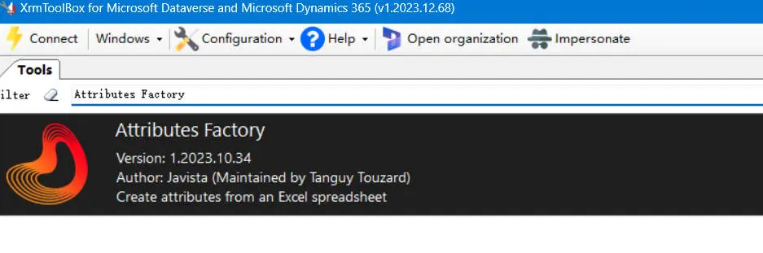
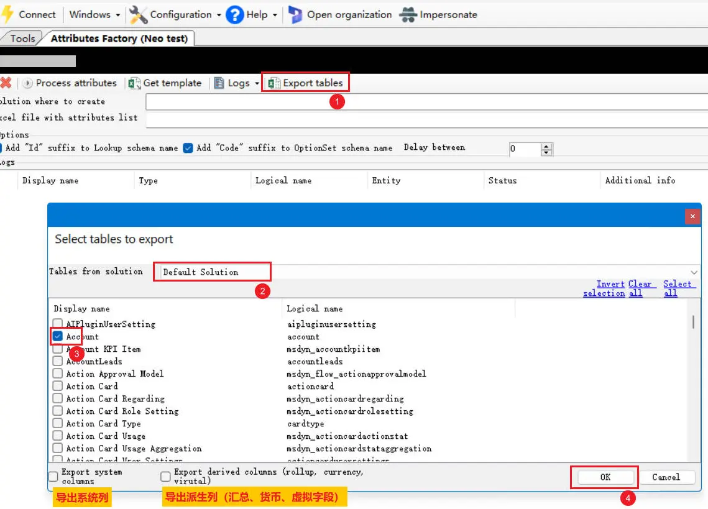
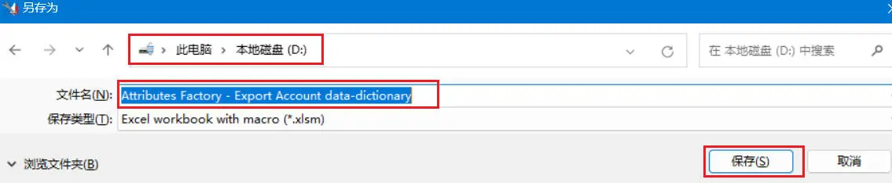
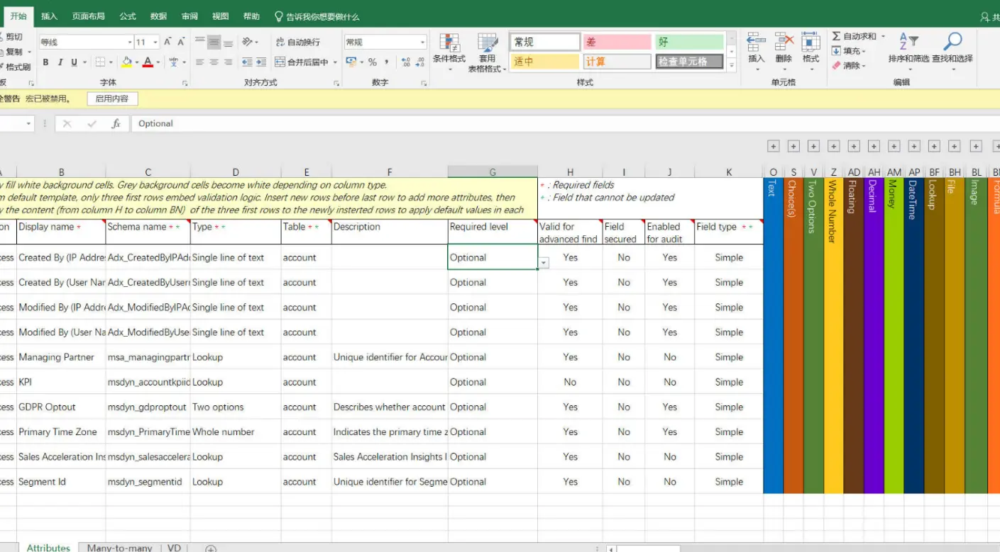

Learn how to export entity metadata and option set values from Microsoft Dynamics 365 or Power Apps using XrmToolBox plugins such as Metadata Document Generator and Attributes Factory, with step-by-step guidance and Excel output examples.

<!--more-->

When working with Microsoft Dynamics 365 or Power Apps, business users may often request details of option sets (choice fields) within an entity.
If the entity contains only a few option set fields, one can simply leverage the **Level up for Dynamics 365/Power Apps** browser extension and use the **SHOW OPTIONSET VALUES** feature, then copy and paste the results into Excel.

However, when an entity contains a large number of option set fields, this manual approach becomes inefficient. A more practical solution is to use XrmToolBox tools that allow exporting entity metadata directly into a structured format such as Excel.

This document introduces two recommended tools for this purpose:

1. Metadata Document Generator
2. Attributes Factory

## Tool 1: Metadata Document Generator

（1）Install and open the **Metadata Document Generator** plugin in XrmToolBox.

（2）Follow these steps:

* Click **Load Entity**
* Select the export file destination
* Choose the entity to export
* Configure the export options as required (see table below)
* Click **Generate Document**

### Available Options

| Option | Description |
| :--- | :--- |
| Include Audit information | Export audit-related metadata |
| Include Field Level Security information | Export field-level security details |
| Include Requirement level information | Export requirement-level metadata |
| Include Valid for Advanced Find information | Export metadata indicating if the field is valid for Advanced Find |
| Include Attribute location in Forms | Export form placement of attributes |
| Exclude Virtual attributes (name, base, date, state) | Exclude virtual attributes such as name, base, date, and state |
| Export all attributes in one sheet (Excel only)      | Export all attributes into a single Excel sheet |
| Gather entity list in a summary (Excel only)  | Include a summary sheet with entity list in the Excel file |

（3）The generated Excel data dictionary will look as follows:

---

## Tool 2: Attributes Factory

Another alternative is the **Attributes Factory** plugin.

（1）Install and open **Attributes Factory** in XrmToolBox.

（2）Steps to export:

* Select **Export tables**
* Choose the target solution
* Check the entities to export
* Select export options as needed
* Click **OK**

（3）Specify the file destination and filename, then click **Save**.

（4）The resulting Excel file will contain the entity data dictionary in the following format:

---

## Conclusion

Both **Metadata Document Generator** and **Attributes Factory** provide efficient ways to export entity metadata from Microsoft Dynamics 365/Power Apps into Excel.
Compared to manual methods, these tools significantly improve productivity when working with entities that contain numerous option set fields or require detailed documentation.
