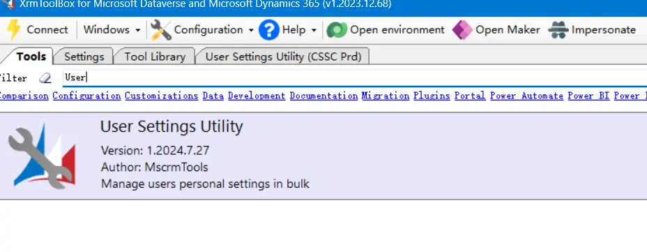
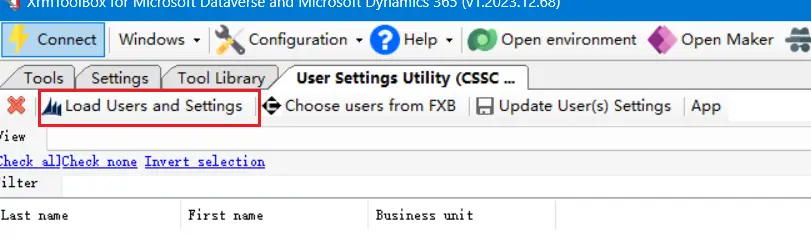
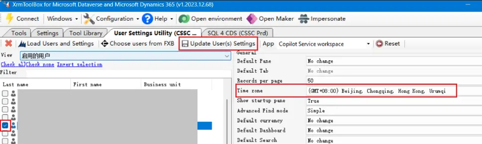
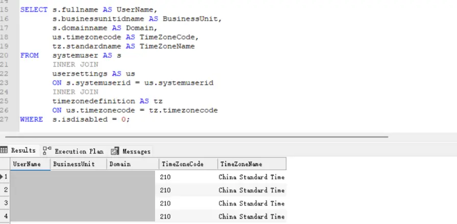

Learn how to set the default time zone for users in Dynamics 365 using the User Settings Utility in XrmToolBox. This guide covers installation, user information loading, and time zone updating, along with SQL queries to retrieve current user time zone settings.

<!--more-->

（1）Install and open **User Settings Utility** in XrmToolBox



（2）Load user information



（3）Select and check the users, choose the desired time zone, and finally click **Update User Settings**



---

Additionally, you can also query the current time zone of users via SQL:

```sql
SELECT s.fullname AS UserName,
       s.businessunitidname AS BusinessUnit,
       s.domainname AS Domain,
       us.timezonecode AS TimeZoneCode,
       tz.standardname AS TimeZoneName
FROM   systemuser AS s
       INNER JOIN
       usersettings AS us
       ON s.systemuserid = us.systemuserid
       INNER JOIN
       timezonedefinition AS tz
       ON us.timezonecode = tz.timezonecode
WHERE  s.isdisabled = 0;
```



### SQL Field Description

| # | Field | Description |
| :---: | :--- | :--- |
| 1 | UserName | Full name of the user. |
| 2 | BusinessUnit | The business unit to which the user belongs. |
| 3 | Domain | The user’s domain account (e.g., `contoso\johndoe`). |
| 4 | TimeZoneCode | The numeric code that represents the time zone in Dynamics 365. |
| 5 | TimeZoneName | The standard name of the time zone (e.g., *Pacific Standard Time*). |
